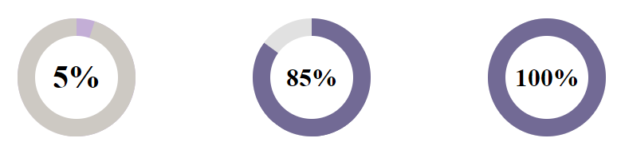

# vue-chart-doughnut

Simple doughnut chart for vue.js 3



## Installation and Usage
```sh
npm i -D vue-chart-doughnut
```
#### Import into a single component.
```js
import ChartDoughnut from 'vue-chart-doughnut/src/components/ChartDoughnut';
```
```vue
<template>
	<chart-doughnut per="5" color="#C3AED6" color-bg="#CDC9C3" text-size="40" />
	<chart-doughnut per="85" />
	<chart-doughnut per="100" />
</template>
```

## Project Setup

```sh
npm install
```

### Compile and Hot-Reload for Development

```sh
npm run dev
```

### Compile and Minify for Production

```sh
npm run build
```
